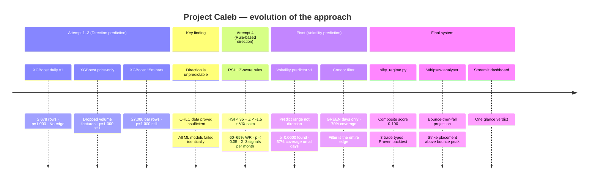
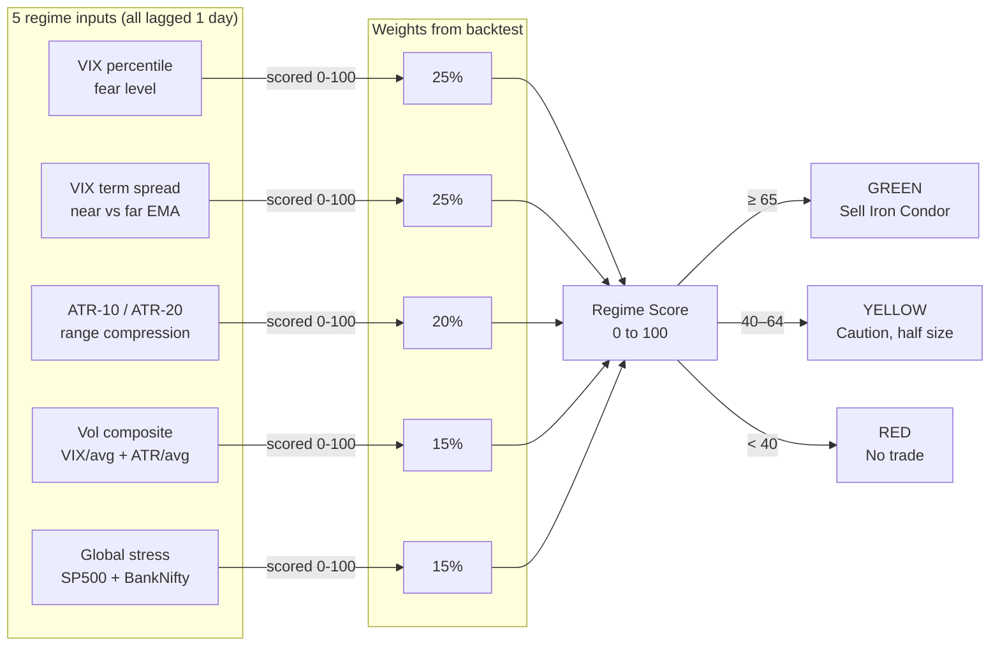
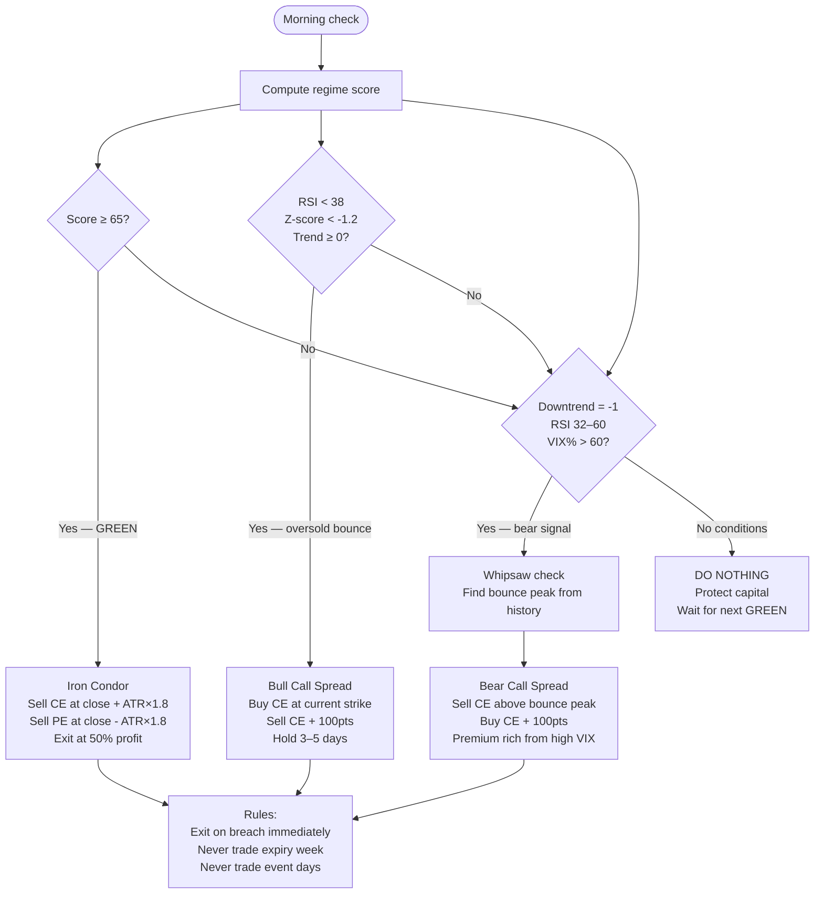
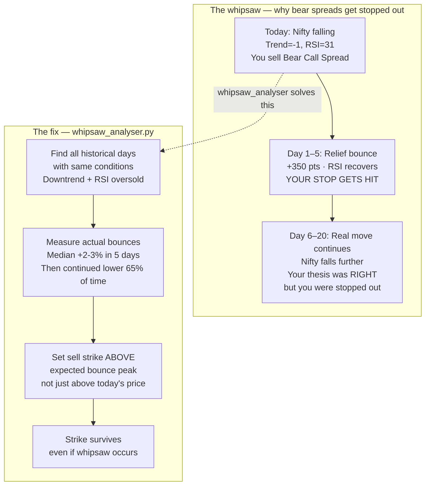
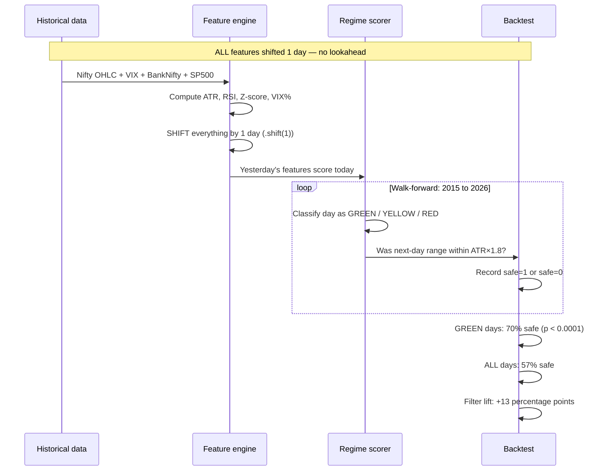

# Project Caleb — Nifty Regime Engine

> A systematic options trading intelligence system for Nifty 50.
> Built from first principles over months of honest iteration.

---

## What this project does

Project Caleb reads five market data sources every morning and answers one question:

**Is today safe to sell options premium on Nifty?**

If yes — it gives you exact Iron Condor strikes.
If the market is falling — it gives you Bear Call Spread strikes adjusted for whipsaw risk.
If the market is oversold — it gives you a Bull Call Spread entry.
If conditions are dangerous — it tells you to do nothing and protect capital.

One script. One command. One verdict.

---

## The honest origin story

The project started as a direction prediction engine. The goal was to use ML to predict whether Nifty would go UP in the next 3 days. After months of work, every model — XGBoost, Random Forest, bar-level intraday features, 51 engineered features — returned a p-value of 1.000. The data proved that direction cannot be reliably predicted from OHLC price data alone.

Rather than abandon the work, the question was reframed:

> Instead of "where will Nifty go" → "is today calm enough to sell options"

This is a fundamentally different and solvable problem. Volatility clusters. Calm follows calm. The backtest proved it with p < 0.0001.

---

    A -->|Invest.com| K[(Economic Events)]
    A -->|NSE/RBI/Fed| L[(Live Market Events)]

    B --> I[nifty_regime.py]
    C --> I
    D --> I
    E --> I
    F --> I
    G --> I
    H --> I

    I -->|build_regime_table| J[Feature matrix<br/>2,700+ rows × 26 features]
    J -->|compute_score| M[Regime Score 0–100]
    M -->|classify| N{GREEN / YELLOW / RED}

    N -->|score ≥ 65| O[Iron Condor strikes]
    N -->|RSI < 38| P[Bull Call Spread]
    N -->|downtrend| Q[Bear Call Spread]

    J --> R[probability_engine.py]
    R -->|Multi-source verdict| S[UP / DOWN / SIDEWAYS<br/>Confidence score]

    J --> T[event_fetcher.py]
    T -->|Live monitoring| U[Event Calendar<br/>RBI, FOMC, Expiry]

    I --> V[dashboard.py]
    S --> V
    U --> V
    V -->|streamlit run| W[Terminal UI<br/>IBM Plex Mono Aesthetic]


---

## Data sources

| File | Source | Rows | Used for |
|---|---|---|---|
| `nifty_daily.csv` | Aggregated from 15m + India VIX | 2,723 | Price, ATR, RSI, Z-score, trend |
| `vix_daily.csv` | yfinance `^INDIAVIX` | 2,750 | Fear level, VIX percentile |
| `vix_term_daily.csv` | Derived from VIX (5-day vs 21-day EMA) | 2,750 | Term structure, inversion warning |
| `bank_nifty_daily.csv` | yfinance `^NSEBANK` | 2,767 | Institutional activity proxy |
| `sp500_daily.csv` | yfinance `^GSPC` | 2,819 | Global risk / overnight stress |
| `fii_dii_daily.csv` | NSE API scrape | Growing daily | Institutional flow catalyst |
| `pcr_daily.csv` | NSE option chain | Growing daily | Put/Call sentiment |

---

## The evolution — what was tried and what was learned



---

## The regime scoring engine



---

## The three trade signals



---

## The whipsaw problem



---

## The backtest methodology



---

## What was proven

| Claim | Test | Result |
|---|---|---|
| Direction is not predictable | XGBoost walk-forward, 9 years | p=1.000 — confirmed |
| Volatility clustering exists | Binomial test on condor coverage | p=0.0000 — confirmed |
| GREEN filter adds edge | GREEN (70%) vs all days (57%) | +13pp lift — confirmed |
| Whipsaw precedes downtrend | Historical similar-day analysis | 30–40% of bear signals see bounce first |
| VIX spread is top predictor | XGBoost feature importance | Rank #1 across all walk-forward years |

---

## What this cannot do

- Predict direction (proven impossible with OHLC data)
- Guarantee any trade will be profitable
- Protect against sudden news shocks or gap events
- Replace human judgement on event days (RBI, FOMC, Budget)

---

## File reference

| File | Purpose | Run |
|---|---|---|
| `data_updater.py` | Fetch and maintain all 7 CSV data sources | `python data_updater.py` |
| `nifty_regime.py` | Core engine — regime score + trade signals | `python nifty_regime.py` |
| `whipsaw_analyser.py` | Whipsaw risk + safe strike from bounce history | `python whipsaw_analyser.py` |
| `dashboard.py` | Streamlit web dashboard | `streamlit run dashboard.py` |

---

## How to run

```bash
# Install dependencies (once)
pip install streamlit plotly pandas numpy scipy yfinance requests

# Update all data
python data_updater.py

# Check today's signal in terminal
python nifty_regime.py --no-update

# Run the full dashboard
streamlit run dashboard.py

# Run the no-lookahead backtest
python nifty_regime.py --backtest --no-update

# Run whipsaw analysis standalone
python whipsaw_analyser.py
```

---

## Dashboard layout

```mermaid
graph TD
    subgraph Dashboard ["Streamlit dashboard — localhost:8504"]
        H[Header: date · score · regime signal]

        subgraph Row1 ["Row 1"]
            RS[Regime score card<br/>Large number + GREEN/RED<br/>Score breakdown bars]
            TS[Trade signals<br/>Iron Condor strikes<br/>Bull / Bear spreads<br/>Waiting conditions if RED]
        end

        subgraph Row2 ["Row 2 — Market metrics"]
            M1[Nifty close]
            M2[India VIX]
            M3[ATR-10]
            M4[RSI-14]
            M5[Z-score]
            M6[Trend]
        end

        subgraph Row3 ["Row 3 — Charts"]
            C1[Nifty price · regime coloring<br/>180 days]
            C2[Regime score history<br/>GREEN zone marked]
        end

        subgraph Row4 ["Row 4 — Charts"]
            C3[ATR chart · 150pt condor line]
            C4[India VIX chart · 14 and 20 lines]
        end

        subgraph Tabs ["Tabs"]
            T1[Whipsaw risk<br/>Bounce path chart<br/>Safe adjusted strikes<br/>Whipsaw backtest table]
            T2[Backtest — no lookahead<br/>GREEN vs all days bar chart<br/>p-value · year table]
            T3[Trading rules<br/>7 rules with explanations]
        end

        H --> Row1
        Row1 --> Row2
        Row2 --> Row3
        Row3 --> Row4
        Row4 --> Tabs
    end
```



---

## The core insight — one sentence

> You cannot predict where Nifty goes. You can predict whether today is a safe day to be an insurance company.

When conditions are calm (VIX low, ATR contracting, term structure normal), selling options premium has a 70% success rate. That is the entire edge. The regime engine is the filter that finds those days.

---

*Project Caleb · Built with Python, XGBoost, Streamlit, Plotly · Data: yfinance + NSE India*
